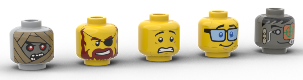
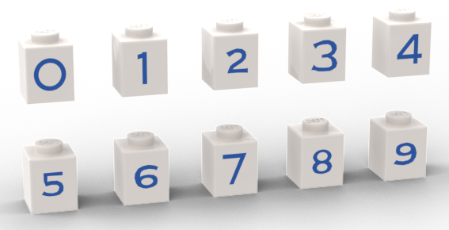
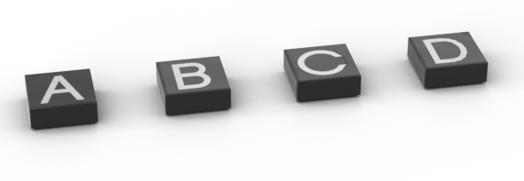
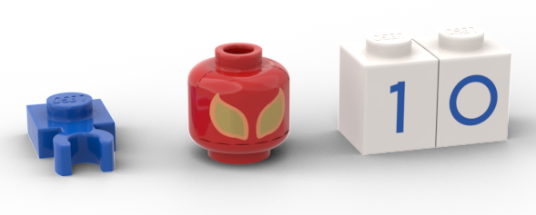
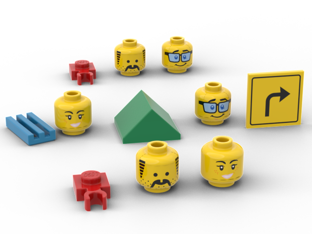
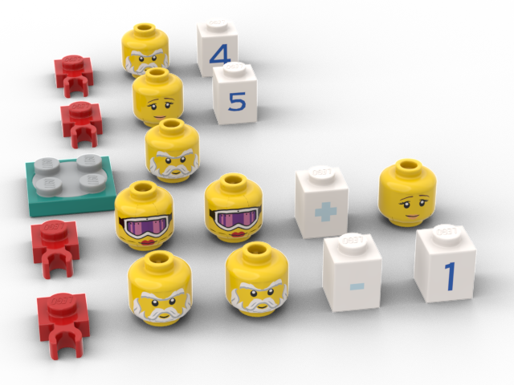
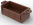

# L language specification

[![CC BY-NC-SA 4.0][cc-by-nc-sa-shield]][cc-by-nc-sa]

General specification for the L language, leveraging LEGO CAD programs (like [stud.io](https://www.bricklink.com/v3/studio/download.page)) as a programming language.

## Overview

> *A [toy language](https://en.wikipedia.org/wiki/Esoteric_programming_language), using toys.*

L is a language that takes the standard file format of LEGO CAD programs and should be able to interpret the file not as a LEGO model, but instead as programming code, often outputting a new LEGO model.

While nothing in here should be taken seriously, the language itself takes itself seriously, and actual programs (within limits) can be made using it. Using L you should be able to compile a pirate ship into a race car, and isn't that why we all wanted to learn to program in the first place?

This language spec makes some assumptions that you have some coding background, but as much as possible is trying to limit how much technical depth you need to catch it all.

## Philosophy

"Why?" is often a hard question to answer, and in this case it may be harder than usual. There's little to "learn" here - learning how to make a complier is documented better than this ever will, and learning to code could be done by picking any other language - but there is joy to be found. And that, joy, is good enough.

If any of this language brings you joy, either by laughing at the standard, or by trying your hand at compiling that pirate ship into a car, then this language has done what it has set out to do.

### Goal: Turing complete

As its first goal, this language should be [Turing complete](https://en.wikipedia.org/wiki/Turing_completeness), but that's a fairly straightforward bar. Still, it feels right that we should be able to get this.

While this is a crude summary that's better tackled by the link above, we'll consider this goal complete if the language has these basic functions:

* Iteration (x + 1)
* Variables
* Comparison operators (if...)
* Loops

To be a functional scripting language we'll need quite a bit more than that though.

### Goal: Flexible construction

Impose as few limitations on your construction as possible to implement the language. While parts may be required to include, keep in mind construction options where possible.

**Practical example:** Part colors and locations within the model should be ignored by the interpreter and considered a "comment", allowing the user to put them wherever in the model they'd like with impact to the program being made.

### Goal: Skeuomorphic tokens

Wherever possible, choose parts for tokens that imply what they represent.

**Practical example:** Minifigure heads () used as variable names since their "brains" are what hold the information.

### Goal: Coding done within an IDE (like stud.io)

While the file format is text-based, and any text editor can then edit that file, general programming should be able to be done within the bounds of a LEGO CAD program. Stud.io is considered the reference implementation for this and is what testing will be done against.

**Practical example:** Stud.io doesn't have a facility to add arbitrary META commands to the file, so while we may leverage META commands, doing basic coding shouldn't then require them.

### LDraw output

With the input of the files being LEGO CAD files (LDraw files), the output should also produce a valid LDraw file.

Note: there is no expectation that this output is itself successfully readable by L, but should be readable by any LEGO CAD program.

## File Standard

The file standard used by LEGO CAD programs is typically in the LDraw format, so that's the format we'll use for this language.

The entire file format is listed on the [LDraw.org](https://www.ldraw.org/article/218.html) site, but we're going to minimize what parts of the file we use.

LDraw files (.ldr files) are readable by most LEGO CAD programs, and any program written for L will still be a valid LDraw file.

A LDraw file is written as a series of lines, each line is one LDraw command. They fall into one of six variations, with the first character of each line noting what it is:

* 0: Comment or META Command
* 1: Sub-file reference
* 2: Line
* 3: Triangle
* 4: Quadrilateral
* 5: Optional Line

Commands 2-4 are used to create the actual shapes of blocks and such. We're not going to address them in the standard here, and instead use pre-defined blocks for our code. These blocks, in turn, use several of those 2-4 commands to create each block, but that's all handled behind the scenes.

The comments and META commands have several official options that can be found in the file spec, linked above. For our programs we're going to largely limit ourselves to the defaults. A simple LDraw file might then look like this:

```l-lang
0 Name: Sample Program
0 Author: Herbie Kay
1 133 -190 160 0 1 0 0 0 1 0 -0 0 1 3004.dat
1 15 -190 160 20 1 0 0 0 1 0 -0 0 1 3004.dat
1 4 -190 152 10 1 0 0 0 1 0 -0 0 1 3068b.dat
1 14 -190 184 10 1 0 0 0 1 0 -0 0 1 3022.dat
```

The lines starting with a 0 are META/comments (in this case the file and author name), and the lines starting with a 1 are the four blocks used to make up this model. Let's look at one line as an example:

```l-lang
1 133 -190 160 0 1 0 0 0 1 0 -0 0 1 3004.dat
```

For the purpose of L, we're going to choose to ignore most of this line, allowing the user to put this part anywhere in the model without affecting how it will be interpreted, but the line can be broken down like this:

```l-lang
1  133      -190 160 0           1 0 0 0 1 0 -0 0 1             3004.dat
1 <color> <x y z {coordinates}> <a b c d e f g h i {rotation}> <part>
```

To make this language as flexible as possible for making models that can both be compiled and actually make something, the color, coordinates, and rotation are all ignored by the interpreter.

This leaves us with pile of parts, then, to make our language.

A META command that's going to be very useful for us is one that helps organize those parts together. It's a "STEP" command and the line is just this:

```l-lang
0 STEP
```

In models, these steps map to steps in an instruction booklet to help someone build the model.

We can also reference other models (for instance, building a tree as its own little thing before being added to the larger model of a house). These can be within the same file as a small submodel, or a pointer to an external file, allowing scripts to be able to call other scripts. How this works is described in the file standard, and below in the *functions* section.

## Tokens

Tokens represent commands and keywords in a language. This is how we'll give meaning to our code. For example to code something like "x = 10" we need to know how to represent a variable (x), an assignment operator (=) and have some way to deal with values (10).

The end of each command (like the x = 10, above) should end in a step command:

```l-lang
0 STEP
```

And since every token or block is also a separate line, a command like our x = 10 will ultimately have to look closer to this:

```l-lang
x
=
10
0 STEP
```

Though, obviously, we'll want to represent those pieces with, well, LEGO pieces. This section will describe just how we are doing that.

### Variables

* Variables are all global in scope.
* Variables are all untyped.

All minifigure heads are variables. Head accessories are left undefined, so you can dress up your minifigure heads in the model however you like, though the head part number itself (the face design) is what is used to "name" an track the variable.


> *Facial expressions can make great ways to imply what sort of information a given variable holds...*

#### Special variables

A few variables are set aside as special and should have additional consideration when used.

| Part         | Use     | Notes |
|--------------|-----------|------------|
| Basic smiley head, `3626ap01` () | Command line args      | Additional command line args passed into the script will be put here        |
| Basic smiley head, female, `3626cpb0633`  ()   | Function args | Any arguments when calling a function will be placed into this variable. This variable can also be used to store return values from functions.      |

### Constants

#### Numbers

Numbers are the standard number blocks 0-9:



The part numbers for these are `3005pt0`, `3005pt1`, `3005pt2`, ... `3005pt9`.

#### Letters

Letters use the letter tiles:



The part numbers for these are `3070bpb009` (letter a), `3070bpb010` (letter b), `3070bpb011` (letter c), ... `3070bpb034` (letter z).

Letter blocks (similar to the numbers, above) also function as letters. Those part numbers are `3005pta`, `3005ptb`, `3005ptc`, ... `3005ptz`.

#### Booleans

| Part  | Value  | Notes  |
|---|---|---|
| Technic pin, `2780` () | True  | All numbers except zero will return true, as will any variable that has text of at least one character in length. |
| Technic half pin, `4274` () | False  | "Is the pin whole?" Variables that evaluate to an empty string ("") or evaluate to zero will evaluate to false |

#### Other Constants

There are a few other defined constants that can be helpful:

| Part  | Value  | Notes  |
|---|---|---|
| Window frame with no glass pane, `60592` () | Null  | Helpful to compare if a variable is empty or similar null results. Assigning a variable to this will clear that variable (similar to `x = ""`)  |

Beyond that, any other brick or piece is considered a literal of that part. This means you can have a variable hold the value of "2x4 brick", for instance.

### Assignments

There isn't a fun piece that looks like an equal sign, so instead we're going to clip parts (values) together with a LEGO clip, part `4085a` (). An assignment will look like `<variable> Clip <value to assign>". To end the command, mark it with a STEP command.

So, to look back up to our original assignment question of "x = 10", let's create that now:

```l-lang
1 4 -70 -24 -50 1 0 0 0 1 0 0 0 1 3626cpb3.dat
1 1 -110 -8 -30 1 0 0 0 1 0 0 0 1 4085a.dat
1 15 -30 -24 -50 1 0 0 0 1 0 0 0 1 3005pt1.dat
1 15 -10 -24 -50 1 0 0 0 1 0 0 0 1 3005pt0.dat
0 STEP
```

Which would create something that looks like this:



Because positions and color are ignored, when building your boat (or house, or dragon, ...) these parts can be put anywhere in the model.

Instead of the clip, there's also a 1x1 block with an "=" pattern on it (part `3005ptisb`) which also functions as an assignment operator in the same way the clip does.

### Math

| Part  | Value  | Notes  |
|---|---|---|
| 1x1 brick with a "plus" sign, `3005ptplusb` () | plus  |  |
| 1x1 brick with a "minus" sign, `3005ptpminusb` () | minus  |  |

Generally these will be used with assignments to create commands like "X = Y + 5".

### Comparison

To get the programmatic equivalent of "If \<x\>, then \<y\>" we have to create some way to do comparisons.

The grill piece, part 2412 (), seems appropriate here since it implies that some things could slip through the grill and some things can't. Sort of an "if this is small enough..." analogy.

The full list of comparison operators is here:

| Part         | Operator     | Notes |
|--------------|-----------|------------|
| 2x1 tile with grill, `2412` () | "If"      | See below for example usage        |
| Road side with turn arrow, `30258pb005` () | "Then"      | Used to mark the break between the if and the actions to take. See below for usage example.        |
| 1x1 brick with clip, `30241b` ()   | Equals | This part parallels the assignment operator (a clip) and is meant to evoke the question "does it clip?" |
| 1x1 double slope, `35464` ()   | Less than | Requires numeric arguments |
| 2x2 double slope, `3043` ()   | Greater than | Requires numeric arguments |

An example of this might be to create a sort of "max" value check. Make X = the max number of the variables Y and Z. (in other languages this might look like `X = max(Y, Z)`, for instance).

```l-lang
1 4 -30 -8 -10 1 0 0 0 1 0 0 0 1 4085a.dat
1 14 10 -24 -10 1 0 0 0 1 0 0 0 1 3626bp3n.dat
1 14 50 -24 -10 1 0 0 0 1 0 0 0 1 3626cp8m.dat
0 STEP
1 321 -80 -8 -130 0 0 0 0 1 0 0 0 0 2412b.dat
1 14 -50 -24 -130 1 0 0 0 1 0 0 0 1 3626cpb1358.dat
1 2 0 -24 -140 0 0 -1 0 1 0 1 0 0 3043.dat
1 14 50 -24 -130 1 0 0 0 1 0 0 0 1 3626cp8m.dat
1 14 90 -20 -140 1 0 0 0 1 0 0 0 1 30258p02.dat
1 4 -50 -8 -230 1 0 0 0 1 0 0 0 1 4085a.dat
1 14 -10 -24 -230 1 0 0 0 1 0 0 0 1 3626bp3n.dat
1 14 30 -24 -230 1 0 0 0 1 0 0 0 1 3626cpb1358.dat
0 STEP

```

In more traditional code, this might look like:

```l-lang
X = Y
if Z > Y then X = Z
```

X, Y, and Z being the three minifigure heads of `3626bp3n`, `3626cp8m`, `3626cpb1358`.

This would create a part set that looks like:



### Loops

Loops function similar to other languages `while` loops. Functionally they look like this: `while <condition is true> <do actions>`

The `while` token is a turntable, `3680c02` (). It should be followed by a variable that will be checked. While that variable is true, the following commands will execute until the next STEP command.

This might look like this:
```l-lang
while X
  Y = Y + 1
```

Take care in your loops to ensure the loop can actually exit (the one above isn't likely to since X doesn't ever change).

While not very exciting, here's a loop example that simulates multiplying two numbers:

```l-lang
X = 4
Y = 5

while X
  Z = Z + Y
  X = X - 1
```

Because zero (0) evaluates as False, this will run until X equals zero, ultimately ending with Z equaling 20.

In L, this will look like this:

```l-lang
1 4 -70 -8 110 1 0 0 0 1 0 0 0 1 4085a.dat
1 14 -30 -24 110 1 0 0 0 1 0 0 0 1 3626bpb0450.dat
1 15 10 -24 110 1 0 0 0 1 0 0 0 1 3005pt4.dat
0 STEP
1 4 -70 -8 50 1 0 0 0 1 0 0 0 1 4085a.dat
1 14 -30 -24 50 1 0 0 0 1 0 0 0 1 3626cp8q.dat
1 15 10 -24 50 1 0 0 0 1 0 0 0 1 3005pt5.dat
0 STEP
1 3 -80 -8 -20 1 0 0 0 1 0 0 0 1 3680c02.dat
1 14 -30 -24 -10 1 0 0 0 1 0 0 0 1 3626bpb0450.dat
1 16 -10 0 -100 1 0 0 0 1 0 0 0 1 multiply
0 STEP
0 NOFILE
0 FILE multiply
1 4 -80 -8 30 1 0 0 0 1 0 0 0 1 4085a.dat
1 14 -40 -24 30 1 0 0 0 1 0 0 0 1 3626bpc87.dat
1 14 0 -24 30 1 0 0 0 1 0 0 0 1 3626bpc87.dat
1 15 40 -24 30 1 0 0 0 1 0 0 0 1 3005pwl.dat
1 14 80 -24 30 1 0 0 0 1 0 0 0 1 3626cp8q.dat
0 STEP
1 4 -80 -8 -30 1 0 0 0 1 0 0 0 1 4085a.dat
1 14 -40 -24 -30 1 0 0 0 1 0 0 0 1 3626bpb0450.dat
1 14 0 -24 -30 1 0 0 0 1 0 0 0 1 3626bpb0450.dat
1 15 40 -24 -30 1 0 0 0 1 0 0 0 1 3005pwm.dat
1 15 80 -24 -30 1 0 0 0 1 0 0 0 1 3005pt1.dat
0 STEP
0 NOFILE
```

Which would render to this:



And should leave the head with the ski goggles there with a value of 20.

Note: Above we had to use a submodel to group our two commands (`Z = Z + Y`and `X = X - 1`). See below under command grouping for more details on that.

### Additional functions

| Part         | Operator     | Notes |
|--------------|-----------|------------|
| simple envelope, `3069bp01` () | Print      | Will output the value of everything until the next STEP. Minifigures (variables) will output their stored value.        |
| envelope with formatting, `3069bpb0851` () | Print with location      | Same as print above, but instead of print deciding the next appropriate, you can set the location of the output. |

See [print.md](print.md) for more specifics on what these two commands output.

### Command grouping and creating new functions

LDraw files have the concept of submodels. A model of a house, for instance, may make the trees outside a submodel, and then some of the furnishings could themselves be submodels. This creates logical groupings of parts of a larger model.

We use them in L to create logical collections of commands. Commands that only accept one action (if and while, most notably) can take one action that itself is a submodel. This creates a sort of pointer to a group of actions that are then treated as one. The programmatic equivalent of a set of parentheses.

In LDraw, a submodel has a name and marked as a "file" within the file:

```l-lang
1 4 -70 -8 110 1 0 0 0 1 0 0 0 1 4085a.dat
1 14 -30 -24 110 1 0 0 0 1 0 0 0 1 3626bpb0450.dat
1 15 10 -24 110 1 0 0 0 1 0 0 0 1 3005pt4.dat
0 STEP
1 16 -10 0 -100 1 0 0 0 1 0 0 0 1 substeps
0 STEP
0 NOFILE
0 FILE substeps
1 4 -80 -8 -30 1 0 0 0 1 0 0 0 1 4085a.dat
1 14 -40 -24 -30 1 0 0 0 1 0 0 0 1 3626bpb0450.dat
1 14 0 -24 -30 1 0 0 0 1 0 0 0 1 3626bpb0450.dat
1 15 40 -24 -30 1 0 0 0 1 0 0 0 1 3005pwm.dat
1 15 80 -24 -30 1 0 0 0 1 0 0 0 1 3005pt1.dat
0 STEP
0 NOFILE
```

The main parts of this are the marker `0 NOFILE` which notes the end of that "file" within the file, and then `0 FILE <name>`, which should end with its own `0 NOFILE` line. With that created, you can reference that submodel by the name given in the `0 FILE` line.

In most CAD programs (like stud.io), you can typically just select a set of parts and turn them into a submodel and the rest is all handled for you.

### Adding blocks without them being interpreted

OK. You now have your cool program that calculates the last digit of pi. But it just looks like a pile of arbitrary parts. These can be rearranged, sure, but how do we go about adding more parts to help make the model into something that also looks great?

This can be handled by adding a stop sign into your code. This sign signifies the end of "code", but doesn't need to be the end of your model. More parts, steps, submodels, anything you want can be added at this point to continue the model without affecting the results of the program.

| Part         | Use     | Notes |
|--------------|-----------|------------|
| Stop sign, `890px1` () | End-of-code marker      | Marks the end of code - all blocks after this point will be ignored. |

## Advanced Features

Advanced features are intended as a convenience but may sometimes bend the rules and conventions established above, particularly by doing things that aren't possible within the standard IDE.

### Comments

It's disappointing that comments are relegated to the "advanced" section, but sticking within the limits of the LEGO CAD as an IDE, there isn't a trivial way to add arbitrary text.

To add a comment, we use a standard META command:

```l-draw
0 // <comment>
```

This form of commenting is already part of the LDraw spec and isn't changed or supplemented further. This allows comments to be handled correctly in any program that already supports the LDraw file format.

### Token mapping

Using META commands, we can tell the interpreter to also consider a piece to count as another piece. The practical effect of this is to allow you to *not* use a part in your construction. For instance, if you were making your program into a boat, and didn't want to use the grill piece () as your "if" command.

There are thousands of "undefined" parts available for use, intentionally including some of the most common bricks. You can utilize these by mapping them to a specific token.

The META command to do this in your code looks like this:

```l-lang
0 !LLANG TOKEN 2412=3001
```

This TOKEN command will then add the part `3001`, a generic 2x4 brick (), to whatever token `2412` is assigned to (`2412` is that grill piece, so in this case it's making it an 'if' command).

Multiple assignments can be made like this, just using any original token value to map to any others. These commands, for instance, create a few new variable options:

```l-lang
0 !LLANG TOKEN 3626ap01=4738a
0 !LLANG TOKEN 3626ap01=18742
0 !LLANG TOKEN 3626ap01=92926
```

In this case, `3626ap01` is a minifigure head (), and `4738a`, `18742`, and `92926` are a treasure chest (), a bucket (), and a trash can (). With these lines, all of which are now usable as variables just the same as any minifigure head. In this example, any existing variable (any minifigure head) could have been used to create the mapping.

These mappings can also be done on one line, separated with commas (but no spaces), like so:

```l-lang
0 !LLANG TOKEN 3626ap01=4738a,18742,92926
```

## License

This work is licensed under a
[Creative Commons Attribution-NonCommercial-ShareAlike 4.0 International License][cc-by-nc-sa].

[![CC BY-NC-SA 4.0][cc-by-nc-sa-image]][cc-by-nc-sa]

[cc-by-nc-sa]: http://creativecommons.org/licenses/by-nc-sa/4.0/
[cc-by-nc-sa-image]: https://licensebuttons.net/l/by-nc-sa/4.0/88x31.png
[cc-by-nc-sa-shield]: https://img.shields.io/badge/License-CC%20BY--NC--SA%204.0-lightgrey.svg
